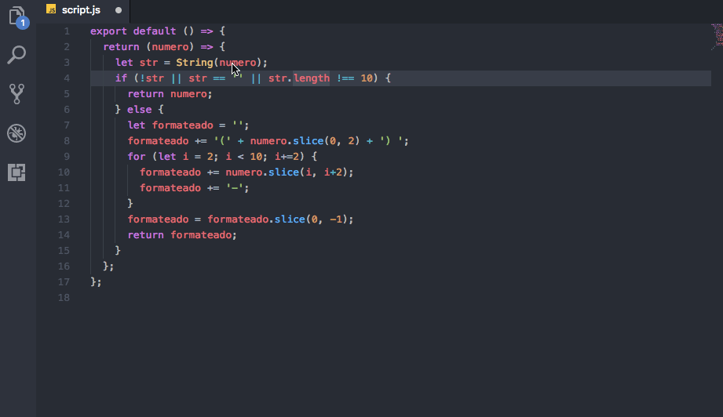
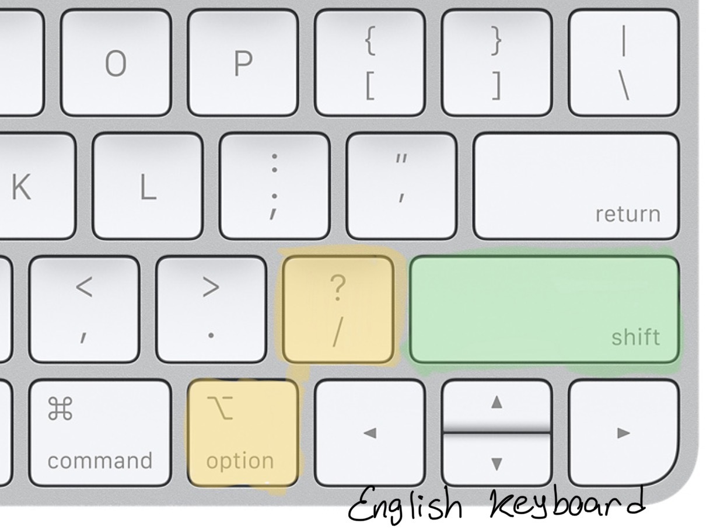
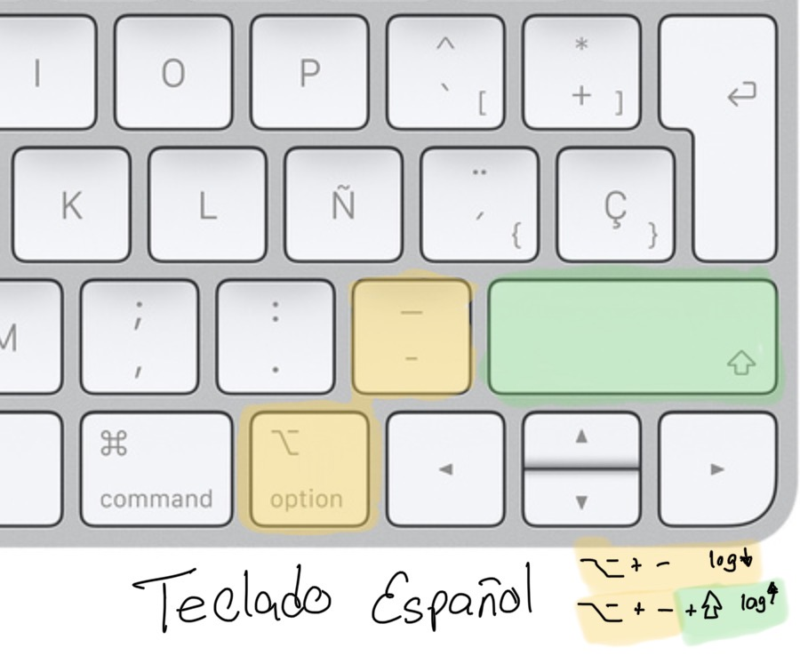
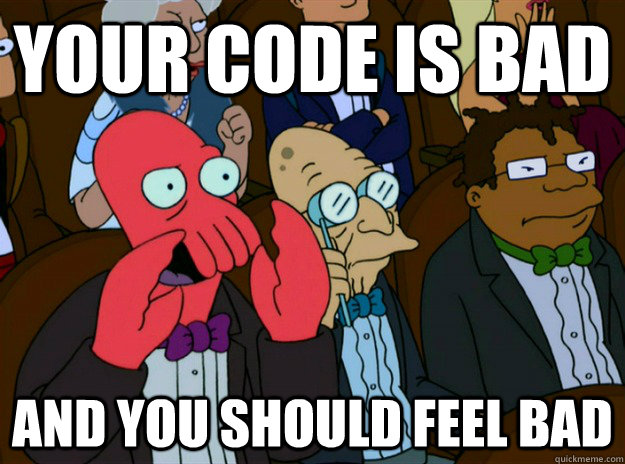

  


[](https://marketplace.visualstudio.com/items?itemName=Luis.console-log) [](https://marketplace.visualstudio.com/items?itemName=Luis.console-log)
[]()  


# Console.log - VSCode

This extension helps you to generate console.log lines with the selected text in the editor,
very useful for every javascript developer (now with support for Dart and Go).

## Features



English             |  Spanish
:-------------------------:|:-------------------------:
  |  

running the command ```Console.log``` will generate a console.log sentence in the line above, taking care of identation.
you can use also the keybinding ```[ alt + - ]``` or ```[ alt + / ]``` in Windows, Linux and MacOSX


## Supported languages:

  

### Console log after (default):

Example outputs:

**javascript / typescript / vue**
```javascript
let enabled = true;
// press [ ⌥ + - ] or [ ⌥ + / ] selecting 'enabled' will produce ↓↓↓
console.log('enabled :', enabled);
```

**dart**
```dart
bool enabled = true;
// press [ ⌥ + - ] or [ ⌥ + / ] selecting 'enabled' will produce ↓↓↓
debugPrint("${enabled}}", wrapWidth: 1024);
```


**go**
```go
enabled := true;
// press [ ⌥ + - ] or [ ⌥ + / ] selecting 'enabled' will produce ↓↓↓
fmt.Printf("enabled: %#v", enabled);
```

### Console log before:

If you want your log in the line before and not after, just add shift:

**javascript / typescript**
```javascript
console.log('enabled :', enabled);
// press [ ⌥ + - + ⇧ ] or [ ⌥ + / + ⇧ ] selecting 'enabled' will produce ↑↑↑
let enabled = true;
```


## Release Notes

### 0.0.8

Support for Dart(print) and Go(fmt.Println)

### 0.0.1

Initial release.


-----------------------------------------------------------------------------------------------------------


